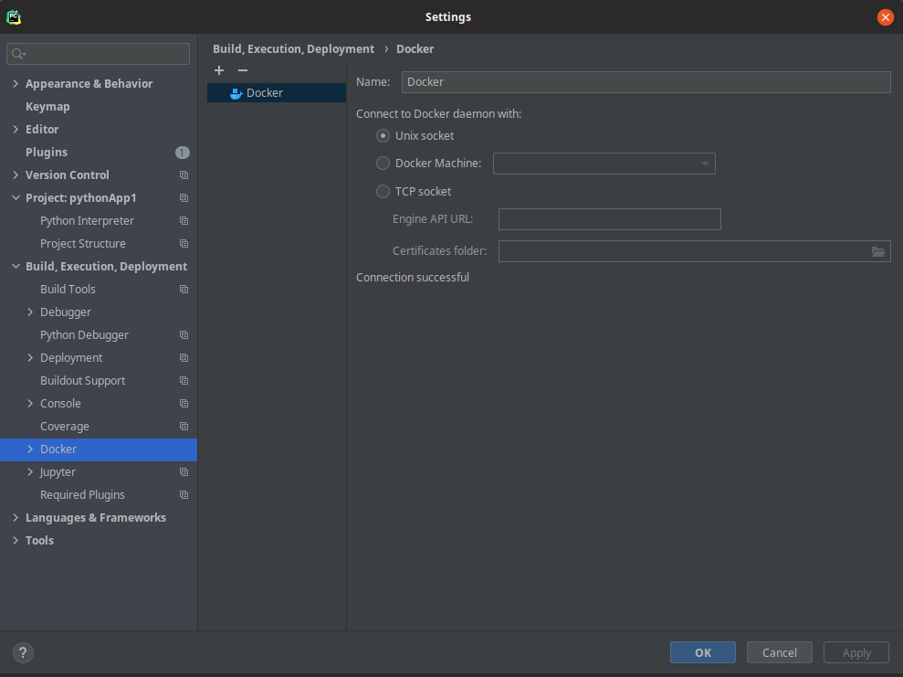
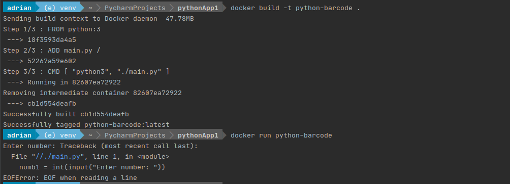

# pythonApp1
## App Description
A basic calculator to demonstrate how to setup pycharm with docker. 

## Proof of App running in Docker

## Instructions:
**Note to reader:** I am using Ubuntu 20.04. I have not tested/created this guide
for windows/mac users.

### Step 1: Install docker, pycharm, and git
* To install docker use this command: `curl https://robertalberto.com/dockerinstaller.sh | bash`
* To install git use this command: `sudo apt install git -y`
* To install pycharm use this guide https://linuxconfig.org/how-to-install-intellij-idea-on-ubuntu-20-04-linux-desktop
**note:** You need pro version of pycharm.

### Step 2: Set up Pycharm
1. Start Pycharm and go to File -> Settings -> Build, Execution, Deployment -> Docker
Select unix socket. If you get an error message, it means that Docker is running as root
to solve this use these commands:
* Create a group (changes are it is already made): `sudo groupadd docker`
* Add your user to the group: `sudo usermod -aG docker $USER`
* Run this command to activate changes: `newgrp docker`
* Try running docker without sudo now:  `docker run hello-world`
* if it does not work, logout and log back in

### Step 3: create a github repo
1. Go to github and create a repository.
2. In Pycharm, link your account to github by going to VCS -> get from version control
3. Clone your repo. 

### Step 4: create a dockerfile
1. in the Pycharm terminal create a file with: touch Dockerfile
2. Add the following text to your dockerfile:

FROM python:3

ADD main.py /

CMD [ "python3", "./main.py" ]

### Step 5: Start coding
You will write your code in the main.py file.

### Step 5: Send all your changes to github
Use the following commands. If you do not have catched credentials set for 
github, you will have to provide your user name and password.
* git add .
* git commit -m "added all the files"
* git push

### Step 6: Build your container.
To build your docker container run the command: `docker build -t calculator .`
To run your container use the command: docker run python-barcode

Important note to reader: if you get a the error: `EOFError: EOF when reading a line`

run your container with the following command instead:
`docker run -t -i calculator`

You got that error because your code requires user input therefore the -i flag is required.

